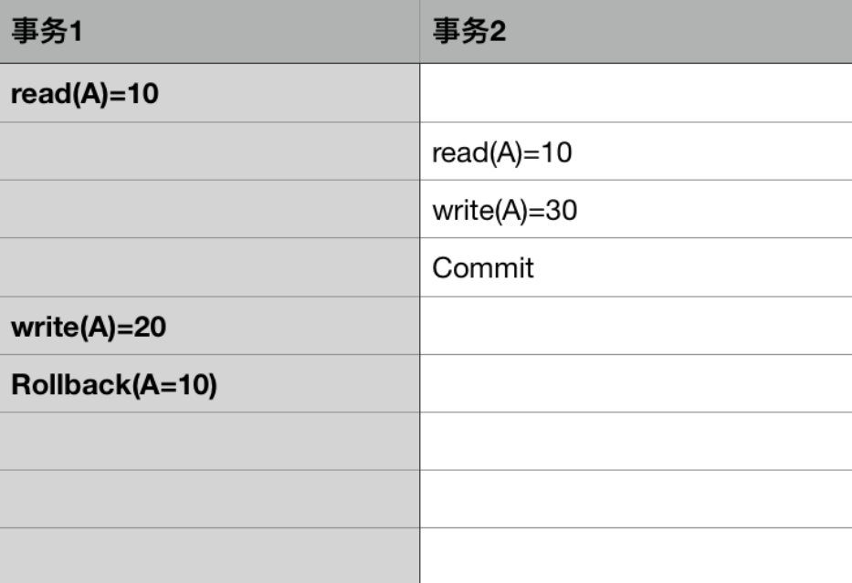
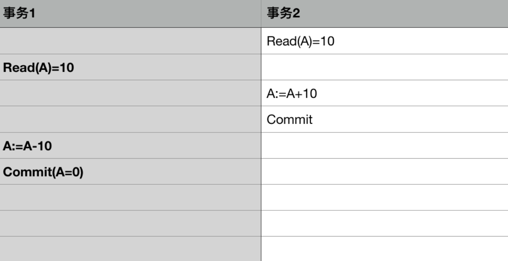
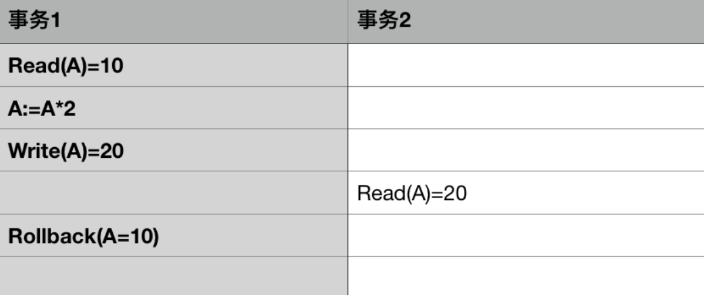
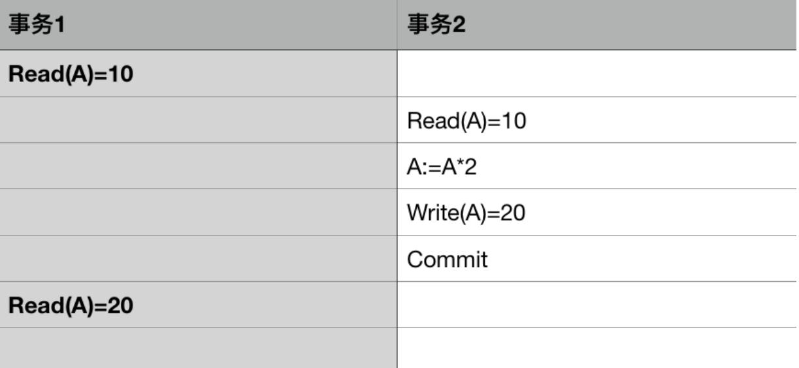
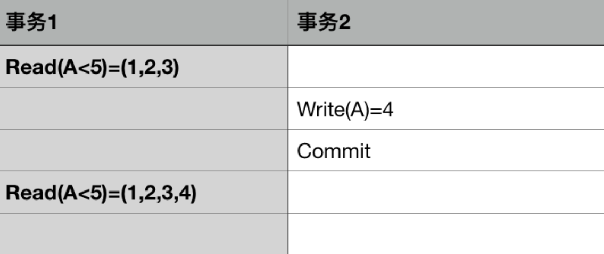

# 关于事务的隔离级别和Spring提供的事务传播行为

​		目前大多数的项目采用SpringBoot开箱即用式的开发, 快速整合的背后, 我们往往忽略一些技术细节, 今天要说的是关于事务的隔离级别和传播行为

## 事务的四大要素(ACID)

- 原子性(Atomicity): 事务包含的所有操作不可拆分, 他们同时成功, 同时失败
- 一致性(Consistency): **对数据的一组特定陈述必须始终成立**, 例如, a用户转账给b用户, 转账前后a与b的总额保持不变
- 隔离性(Isolation): **事务与事务之间是不互相干扰完全隔离的**, 多个并发事务之间完全隔离
- 持久性(Durability): 一旦事务被提交, 数据的改变就是持久的, 永久的


## 常见并发问题

​		在并发下, 可能会出现一些问题, 常见的有如下几种:

- 脏写

  脏写是指事务回滚了其他事务对数据项的已提交修改,比如下面这种情况

  

  事务1对数据A的回滚, 导致事务2对A的提交也被回滚了

- 丢失更新

  丢失更新是指事务的提交导致其他事务的提交被覆盖, 比如下面这种情况:

  

  事务1对数据A的提交, 导致事务2对数据A的提交被覆盖

- 脏读

  脏读是指事务中读取到了其他事务未提交的数据, 例如:

  

  事务2读到了事务1中未提交的数据, 最终事务1回滚, 事务2中数据错误

- 不可重复读

  不可重复读是指事务中对同一数据的多次读取结果不一致, 例如:

  

  事务1中对数据A的两次读取, 第2次读到了事务2中已经提交的数据A的数据, 两次结果不一致

- 幻读

  幻读与不可重复读类似, 不同之处在于幻读是对一组数据的读取结果不一致, 例如:

  

  事务1查询A<5的数据,由于事务2插入了一条A=4的数据,导致事务1两次查询得到的结果不一样


## 事务的隔离级别

​		事务的隔离级别就是为了解决这些问题的. 各大数据库厂商针对数据库本身实现的不同, 通常事务的隔离级别有如下四种:

- READ_UNCOMMITED(读未提交)
- READ_COMMITED(读已提交)
- REPEATABLE_READ(不可重复读)
- SERIALIZABLE(串行化)

具体的隔离级别解决的问题如下表:


**绝大部分的数据库产品(oracle, SQLServer等)的默认数据库隔离级别都是READ_COMMITED(读已提交), MySQL的默认隔离级别是REPEATABLE_READ(不可重复读)**

一般互联网项目对隔离级别的设置都是READ_COMMITED(读已提交), 因为数据库在实现事务的隔离时, 通常采用加锁的方式, 级别越高, 数据库的并发性能越低


## 事务的传播行为

​		事务的传播行为通常是指Spring定义的七种传播行为:

- REQUIRED: 如果当前存在事务, 则在当前事务中运行, 否则创建一个事务

- REQUIRED_NEW: 必须在自己独立的事务中运行, **<u>一个新的事务会被创建</u>**, 如果当前存在事务, 则将当前事务挂起.

- SUPPORT: 如果当前存在事务, 则在当前事务中运行, 否则将以非事务方式运行

- NOT_SUPPORT: 当前方法不会运行在事务中, 如果当前存在事务, 则将当前事务挂起

- NESTED: 嵌套事务, 如果当前存在事务, 则会以嵌套事务的方式运行, 嵌套事务独立于当前事务进行提交和回滚, 如果当前不存在事务, 则创建一个事务. 需要注意的是**嵌套事务仍然是当前事务, 当前并没有创建新的事务**

- MANDATORY: 当前方法必须在事务下运行, 如果当前不存在事务, 抛出异常

- NEVER: 当前方法不支持事务, 如果当前存在事务, 抛出异常

  

  ​	事务的传播行为定义了当多个事务产生交集的时候, 事务之间的传播关系, 例如, 张三有100块钱, 他要去买4本书, 一本书30元钱, 这里面张三买书的行为就是一个典型的事务传播, 体现在程序中, 我们需要根据不同的业务逻辑定义不同的传播行为: 到底是让张三买三本书呢, 还是让张三一本书都买不到

  ```java
  // 张三买书
  public void methodA() {
      for (...) {
          methodB();
      }
  }
  
  // 单本书扣款
  public void methodB() {
      // ...余额不足时抛出异常
  }
  ```

  上面是抽象出来的伪代码, 我们针对不同传播行为的设置产生不一样的结果:

1. 张三一本书都不让买

   ```java
   // 张三买书
   @Transactional(rollbackFor = Exception.class)
   public void methodA() {
       for (...) {
           // catch掉methodB中的异常
           try {
               methodB();
           } catch (Exception e) {
               log.error("购买异常!");
           }
       }
   }
   
   // 单本书扣款
   @Transactional(rollbackFor = Exception.class)
   public void methodB() {
       // ...余额不足时抛出异常
   }
   ```

   注意看代码, methodA中已经catch了methodB中的异常, 但由于他们的传播行为为默认的REQUIRED, 他们在同一事务下运行, 当methodB抛出异常时, methodA与methodB中的全部操作回滚

2. 张三只购买了三本书, 最后一本购买失败

   ```java
   // 张三买书
   @Transactional(rollbackFor = Exception.class)
   public void methodA() {
       for (...) {
           // catch掉methodB中的异常
           try {
               methodB();
           } catch (Exception e) {
               log.error("购买异常!");
           }
       }
   }
   
   // 单本书扣款
   @Transactional(rollbackFor = Exception.class, propagation = Propagation.NESTED)
   public void methodB() {
       // ...余额不足时抛出异常
   }
   ```

   当前设置中, 由于methodB为嵌套事务, 它独立回滚, 不影响methodA的提交, 因此最后一本书购买失败, 张三最终购买了三本书

