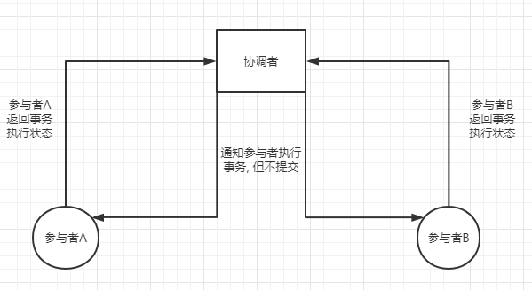
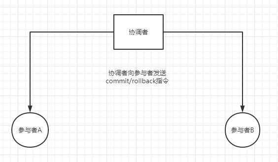
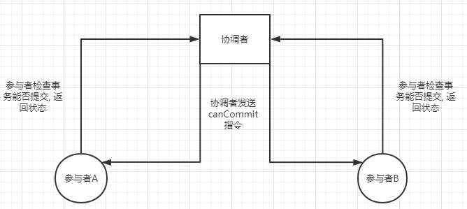
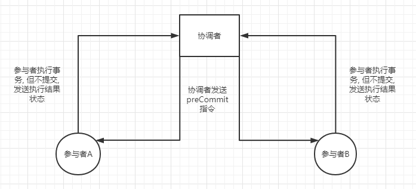
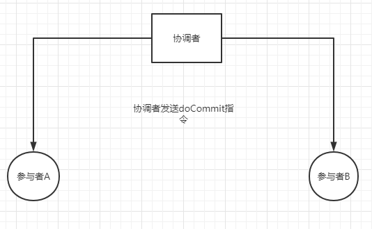
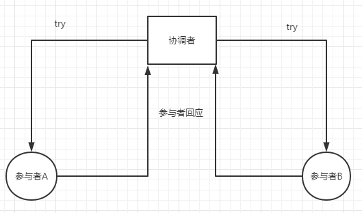
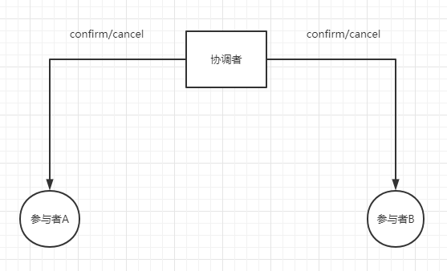
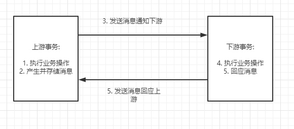

# 微服务架构中的分布式事务

## 前言

​		在传统单体应用演变为分布式架构后, 解决了许多单体应用存在的痛点, 例如扩展性差, 可维护性差, 数据库性能瓶颈等问题, 但是分布式的架构同样为我们带来了新的痛点, 系统复杂度变高, 开发调试起来更加的困难, 同时引入了分布式事务, 分布式锁, 链路追踪等等问题, 最近一段时间学习了有关分布式事务的知识, 现对其做如下总结

## 什么是分布式事务

​		在传统的单体应用中, 事务我们已经非常熟悉, 对于我们的业务操作, 由于在jvm中处于同一线程执行, 数据库本地事务可以方便的对我们的操作进行提交或者回滚

​		在分布式系统中, 微服务之间采用rpc的调用方式, 服务与服务之间彼此互相独立, 相互调用, 而服务本身具有自己的本地事务, 这样, 我们调用方的本地的事务无法对调用方的本地事务操作判断其提交或者回滚, 于是分布式事务就产生了

### 分布式系统的CAP理论

#### 一致性(**Consistency**)

#### 可用性(**Availability**)

#### 分区容错性(**Partition Tolerance**)

​		<u>CAP理论: 分布式系统只能同时满足一致性, 可用性, 分区容错性中的两种, 无法三者兼得</u>

## 分布式事务的解决方案

​		目前主流的分布式事务的解决方案有如下几种:

### XA协议

​		XA协议是**基于数据库本身**的一种分布式事务解决方案, 其实现为**2PC(二阶段提交)**, 还有基于2PC的改良**3PC(三阶段提交)**, 简单介绍一下这两种方式:

#### 2PC(二阶段提交)

​		在分布式事务中, 2PC将各个本地事务称之为分布式事务的***参与者***, 而除了参与者外, 还需要一个***协调者***, 协调者用来整体控制参与者的事务提交或回滚. 二阶段提交, 顾名思义, 就是将事务的提交分为了两个阶段, 其流程如下:

##### 第一阶段: 请求/投票阶段

​		

​		协调者向参与者发起事务执行命令, 所有参与者执行事务, 执行后返回执行的状态(成功/失败), 并**锁定资源不提交事务, 进入等待状态**

##### 第二阶段: 执行(commit/rollback)阶段

​		

​		根据第一阶段参与者的返回状态, 向所有参与者发送提交/回滚指令, 当全部参与者返回成功时, 发送提交指令, 否者发送回滚指令

​		由上述流程可知, 2PC是一种**强一致性的解决方案**, 但是2PC有着如下的缺点:

1. 该解决方案中, 所有的参与者都是阻塞式的, 参与者的事务最终提交与否, 必须等待协调者接受全部参与者的返回状态后发送的指令, 在此期间, 线程是阻塞等待的, 造成其**性能低下**
2. **没有超时机制**: 在第一阶段结束后, 如果协调者发生故障, 或者部分参与者由于网络波动等原因并没有接收到协调者的第二阶段指令, 其事务将会一直处于等待状态
3. **并没有完全的解决数据一致性的问题**: 当第一阶段所有参与者返回成功, 协调者发起提交指令, 如发生2所说情况, 部分参与者提交本地事务, 而部分参与者没有提交, 产生了数据一致性问题

#### 3PC(三阶段提交)

​		由于二阶段提交的问题, 由此产生了3PC, 3PC目前可能只是一个理论上的方案, 并没有发现其最终实现, 所谓三阶段提交, 就是在原有的二阶段提交的第一阶段基础上, 扩展了一个预提交状态, 同时对全局引入了***超时机制***, 其具体细节如下:

##### 第一阶段: canCommit阶段

​		协调者发送canCommit指令, 各个参与者检查其事务能否提交(例如能否获取到锁)

##### 第二阶段: preCommit阶段

​		协调者发送preCommit指令, 各个参与者开始执行事务, 但不提交, 发送执行的结果状态

##### 第三阶段: doCommit阶段

​		协调者向所有参与者发送doCommit指令

​		三阶段提交在二阶段提交的基础上, 增加了一个阶段, 同时增加了超时机制, 即: **参与者, 在超过指定时间后, 将会自动提交, 协调者在第一阶段和第二阶段超时未接受到参与者响应, 将全局发送abort(回滚)指令, 协调者在第三阶段超时未接收到参与者回应, 将全局发送commit(提交)指令(这个应该是基于概率的, 当进入第三阶段了, 我们有理由相信提交结果成功)**

​		三阶段提交其实并没有完全解决数据一致性的问题, 而且由于XA协议的阻塞性, 因此, **互联网公司一般不采用该方案**

### TCC补偿型事务

​		补偿型事务(TCC)是 Try - Comfirm - Cancel 三个单词的首字符缩写, 其实现是***基于2PC***的, 是一种**业务层的分布式事务解决方案**, 对需要进行补偿型事务的业务, 每个本地事务都需要实现 **Try & Comfirm & Cancel** 三个接口, 其具体步骤如下:

##### Try阶段

​		

​		在Try阶段, 协调者向所有参与者发送Try指令, **接收到Try指令的参与者开始对当前本地事务需要用到的资源进行检查, 冻结资源**, 这个对资源的预检查操作对外是可见的, 即其他事务能够知道该资源被冻结, 它不可使用. 

##### Confirm阶段/Cancel阶段

​		

​		在这个阶段, 协调者会针对上一阶段所有参与者的try阶段的处理结果进行判断执行confirm或者cancel

1. 所有参与者try阶段都成功: 执行confirm指令, 参与者接收到confirm指令后, 对try阶段的预留资源进行真正的处理, 消耗掉这部分被冻结的资源

2. 只要有参与者try阶段失败: 执行cancel指令, 参与者在接收到cancel指令, 对try阶段冻结的资源进行释放, 业务取消

> TCC事务中的注意点/TCC事务与2PC的区别
>
> 1. **<u>try - confirm - cancel 三个接口都要实现幂等性</u>**:  由于网络等原因, 协调者会对没有响应的参与者多次重试发送指令, 此时, 必须对三个接口保证幂等性
>
> 2. TCC事务是业务层面的, 它具有更好的兼容性, 可以实现夸数据库分布式事务, 而2PC是数据库层面的
>
> 3. TCC事务是会记录事务日志的, 出错后, 能够通过事务日志恢复到事务执行前的状态

## 基于可靠消息的最终一致性解决方案

​		由于分布式系统的CAP理论, 我们不可能同时满足一致性, 可用性和分区容错性, 在互联网企业中, **通常采用的是一种牺牲强一致性, 保证可用性和分区容错性, 实现业务数据<u>最终一致性</u>的解决方案**. 保证服务可用, 牺牲一些时效, 通过可靠消息避免产生分布式事务

​		借助中间件消息队列, 我们实现了应用之间的解耦, 我们可以基于消息队列避免产生分布式事务

### 本地消息服务方案

​		在分布式架构中, 系统的调用链路存在上下游关系, 我们可以采用消息队列通知的方式实现系统间的解耦, 根据上游事务的处理结果对下游事务发送消息, 下游事务处理完之后对上游事务发送响应通知, 具体如图:

1. **在本地消息服务方案中, 上游事务在执行后, 根据执行结果产生并存储消息, 业务操作的执行与消息的产生存储都是上游事务的组成部分, 保证他们能够同时成功**

2. 上游事务的消息通知应该具有重试机制, 当一段时间没有接受到下游事务的响应消息通知后, 应该发送重试, 因此, 下游事务应该保证接口的幂等性, 重试机制具有时效, 当多次重试失败后, 该业务回滚

#### 本地消息服务的业务补偿机制

​		**本地消息服务应当具有业务的补偿机制, 如上图, 当下游事务操作异常, 通知上游事务后, 上游事务应当具有回滚操作, 当业务的复杂度提升后, 比如调用链路加长, 可能还会产生分支, 上游事务应当具有全局的回滚通知, 通知其他所有的下游业务触发回滚操作, 最终保证数据的最终一致性, 由此可见, 基于本地消息的最终一致性解决方案只适用于短链路, 在长链路下, 其消息的通知复杂度将成倍提升, 同时由于消息与业务耦合在一起, 大量占用业务系统的资源**

### 基于MQ的事务消息的独立消息服务方案

​		目前有些消息队列产品已经实现了事务消息(例如RocketMQ), 通过事务消息, 我们可以搭建独立的消息服务, 与业务服务独立开, 减少业务系统通知消息的开销, 减少了消息收发对业务的侵入

​		拿市面上实现了事务消息的RocketMQ举例子, 它对于事务操作流程如下:

1. 上游方开启事务, 同时向消息服务系统发送一个"预处理"消息, 它并不会被消息队列马上投递, 而是存在消息队列中

2. 如果投递"预处理"消息失败, 则关闭事务, 业务操作不执行

3. 如果投递"预处理"消息成功, 开始执行业务操作, 执行完成后, 根据业务操作的结果, 标记之前预处理消息的状态为"可发送"或者"不可发送"

4. **<u>此时消息的状态可能存在三种: "可发送", "不可发送", "未知", 标记为"可发送"的消息, 才会马上被消息队列投递, 而状态为未知的消息, 在一定时间后RocketMQ会对消息进行回查, 因此, 上游方还需要实现一个回查的接口, 用于查询当前投递的预处理消息的可投递状态</u>**

5. 下游方实现对上游方消息的监听, 一旦接受到消息, 开始执行业务操作, 后面的操作同本地消息服务

> ​		对比事务消息与本地消息, 最大的区别是将本地消息中, 我们对消息的重试补偿机制放到了mq中, 使得我们的业务操作不需要维护消息的发送补偿

#### RocketMQ对于业务回滚的看法

​		RocketMQ并没有对事务消息实现回滚的机制, 在上游通知成功后, 如果下游执行业务发生了异常, 需要对业务操作进行回滚, 我们需要自己发送回滚的通知, 在本地消息服务中, 我提到了回滚通知的复杂度将会因为业务复杂度的提升(调用链路的增加)成倍提升, 非常不利于后期的维护和调试

​		RocketMQ官方对于回滚操作建议使用**人工处理**的方式, 实际上, 我们在上游业务中就应该保证对于调用链路的可用性进行校验, 这样, 下游链路的业务执行失败已经是小概率事件, 实际业务往往是很复杂的, 对于自动化回滚的操作开发难度大, 维护成本高, 综合考虑下来人工处理可能是最佳的处理方案

## 对于分布式事务自己的看法

​		分布式事务一直是分布式系统中业内公认的最大难点和痛点, 在构建一个高可用的系统下, 如何兼顾数据的一致性, 这个需要根据实际的业务需求来考量, 目前没有任何一种完备的方案能够完美的解决, 只能根据自己的实际业务进行取舍, 我们在理解了分布式事务的主流解决方案后, 对分布式事务有一个比较清晰的认知后, 才能根据自己的实际业务场景选择自己合适的解决方案